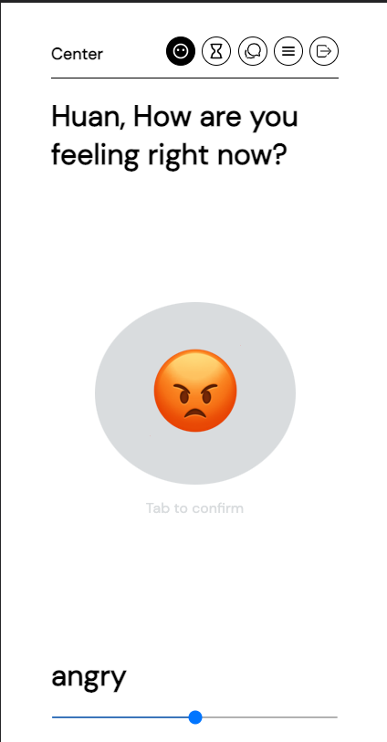
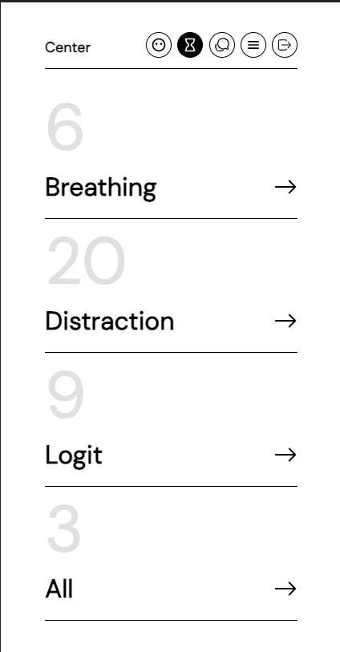
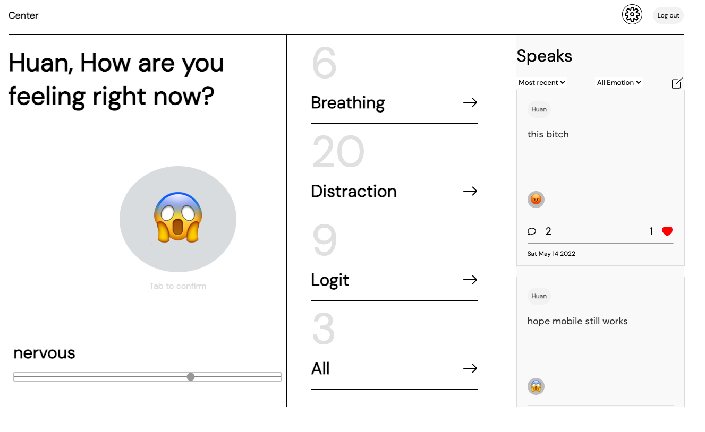

# 😞 Center 😀

---

#### Date: 5/04/2022

---

##### By: Huan Zeng

[Website](https://center-mood-tracker.herokuapp.com) | [Linkedin](https://www.linkedin.com/in/huan-zeng/) | [Github](https://github.com/huan00/center_back) | [Trello](https://trello.com/b/cXQCzaWt/center)

---

#### Description:

Center is a therapy application, where user can get advise on dealing with their current emotion. eg. if you are feeling nervous, an advise could be take a deep breath.

---

#### Getting Started

Sign up and sign in, answer a few questions on your current mood. You can get advise or leave advise for other users.

#### Features

- user profile
- enter current emotion
- enter advise for others
- follow other message

---

#### Technologies

##### Back-end

- PostgreSQL
- MiddleWare
- JWT

##### Front-end

- HTML
- CSS
- React
